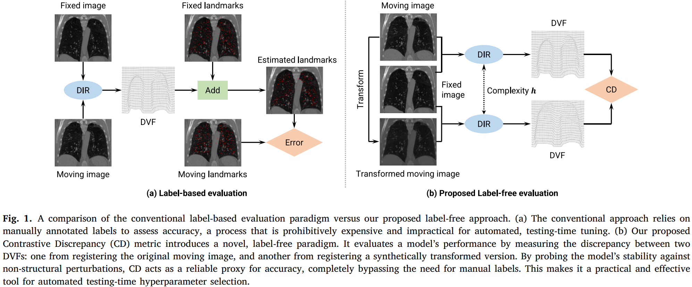
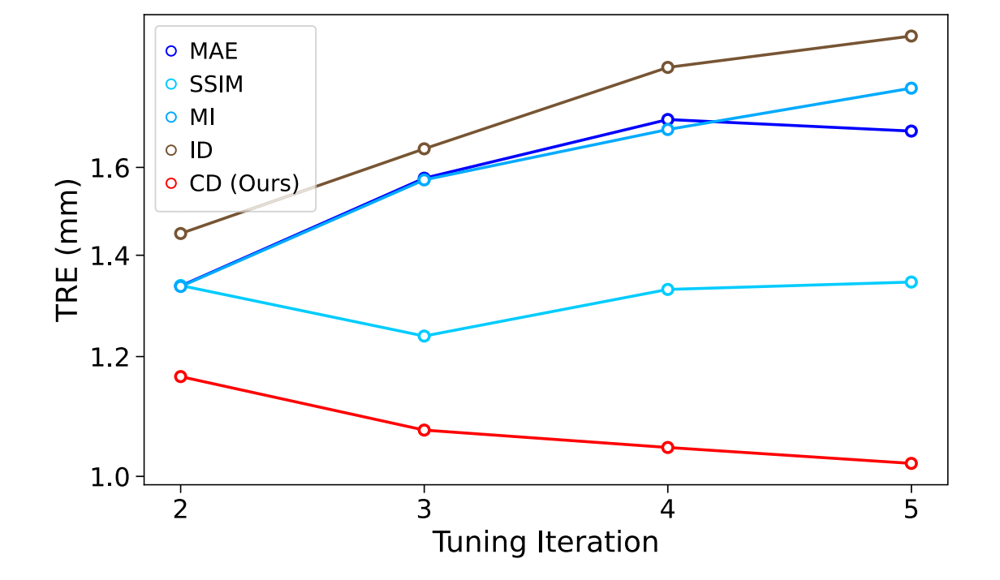

<div align="center">

# Contrastive Discrepancy: A Label-Free Metric for Deformable Image Registration

[](https://doi.org/10.1016/j.media.2026.104210)
[](https://pubmed.ncbi.nlm.nih.gov/42442211/)
[](https://www.python.org/)
[](https://pytorch.org/)

**Xia Li**\*, **Jihe Li**\*, Weijie Wang, Xiang Liu, Jiquan Yuan, Xixin Cao, Joachim M. Buhmann, Jianqi Sun†

<sub>\* Joint first authors &nbsp;•&nbsp; † Corresponding author &nbsp;•&nbsp; Medical Image Analysis, 2026</sub>

</div>

<p align="center">
  
</p>

> **Contrastive Discrepancy (CD)** evaluates a deformable image registration model without any
> annotation. Rather than scoring a single registration in isolation, it registers the fixed image
> against two observations of the same anatomy — the moving image and a mildly affine-transformed
> variant — and measures how far the two resulting deformation fields disagree. The score is a
> reliable proxy for registration error, which makes fully automatic, patient-specific
> hyperparameter selection possible at testing time.

---

## Contents

1. [Method](#method)
2. [Installation](#installation)
3. [Data Preparation](#data-preparation)
4. [Evaluation](#evaluation)
5. [Hyperparameter Selection](#hyperparameter-selection)
6. [Configuration](#configuration)
7. [Results](#results)
8. [Citation](#citation)

## Method

An ideal registration model is equivariant: transforming the moving image by a group element `g`
should transform its deformation field the same way, and nothing more. CD probes that property by
registering the fixed image `F` against `M_a` and against `M_b = g · M_a`, then comparing the two
fields after pulling them back to a common frame.

Under a bias–variance view of the group orbit, the expected discrepancy decomposes into
`2·Var(h) − 2·Cov(h)`. Overfitted models are penalised through high variance; underfitted models
through a bias-induced negative covariance. CD therefore traces a U-shaped curve in model
complexity that mirrors the gold-standard Target Registration Error — without labels.

| Metric | Definition |
| :-- | :-- |
| **CD₂** | Mean absolute error between the warped moving images `M_a∘φ_a` and `M_b∘φ_b`, both of which live in the fixed-image frame. |
| **CD₃** | Mean norm of the residual deformation field obtained by registering `M_a∘φ_a` to `M_b∘φ_b` with the same model and hyperparameters. |

CD is a property of the evaluation protocol, not of any particular registration model. This
repository is therefore organised as a small framework in which the model, the optimiser, the
dataset and the group action are independent, swappable components. The reference implementation
ships [GaussianDIR](https://github.com/Jihe-Li/GaussianDIR) and the DIR-Lab benchmark.

## Installation

**1. Create a conda environment.**

```bash
conda create -n cd python=3.12
conda activate cd
```

**2. Install PyTorch** following the official documentation for your CUDA version.

```bash
conda install pytorch torchvision torchaudio pytorch-cuda=12.1 -c pytorch -c nvidia
```

**3. Install PyTorch3D**, used for the K-NN lookup of the Gaussian primitives. Download the
[matching package](https://anaconda.org/pytorch3d/pytorch3d/0.7.8/download/linux-64/pytorch3d-0.7.8-py312_cu121_pyt241.tar.bz2)
and install it from the local file.

```bash
conda install /path/to/pytorch3d-0.7.8-py312_cu121_pyt241.tar.bz2
```

**4. Install the remaining requirements.**

```bash
pip install -r requirements.txt
```

## Data Preparation

| Dataset | Subset used | Reference metric | Download |
| :-- | :-- | :-- | :-- |
| **DIR-Lab 4DCT** | all 10 cases, maximum inhalation (T00) → exhalation (T50) | TRE on 300 landmarks per case | [link](https://med.emory.edu/departments/radiation-oncology/research-laboratories/deformable-image-registration/index.html) |
| **Lung250M-4B** | the validation split, cases 114–123 (TCIA-NLST) | TRE on 100 landmarks per case | [link](https://github.com/multimodallearning/Lung250M-4B) |

Both are lung CT. Lung250M-4B aggregates several sources under one case numbering; cases 114–123
are the ten TCIA-NLST pairs it marks as validation, extracted at maximal inspiration and
expiration. The paper reports results on these ten, not on the full 20-pair TCIA collection.

Convert the volumes to NIfTI, keeping the original spacing and unnormalised intensities, and
generate the lung masks with [lungmask](https://github.com/JoHof/lungmask). Place everything into
the folder `data` following the layout below; the root can be changed in
`configs/datasets/dirlab.yaml`.

<details>
<summary><b>Expected folder layout</b></summary>

```text
data/DIRLab/Case<i>Pack/                       # i = 1 … 10, T00 is fixed and T50 is moving
├── Images/case<i>_T<p>0.nii.gz                # p = 0 … 5
├── Lungs/case<i>_T<p>0.nii.gz                 # lung mask, used as the region of interest
└── ExtremePhases/Case<i>_300_T<p>0_xyz.txt    # 300 landmarks, only used to report the TRE
```

</details>

Landmarks are read only to report a reference TRE alongside CD. They never enter the computation of
the metric itself. For data of any other kind, the generic `nifti` dataset takes explicit paths and
needs neither masks nor landmarks:

```bash
python run.py datasets=nifti \
  datasets.fix_image=/path/fix.nii.gz \
  datasets.mov_image=/path/mov.nii.gz
```

## Evaluation

Compute CD for a single case at a single model complexity.

```bash
python run.py datasets.case_idx=1 network.num_gaussians=6400 metric=both
```

The command runs the registrations behind the metric — `F→M_a`, `F→M_b`, and, for CD₃, the residual
registration between the two warped results — prints the scores next to the reference TRE, and
appends a row to `outputs/results.csv`.

Every entry of `configs/config.yaml` can be overridden on the command line, so sweeping the model
complexity over the whole dataset is a matter of looping over two fields.

```bash
bash scripts/run.sh
```

## Hyperparameter Selection

CD is unimodal in model complexity, so its minimum can be located with a ternary search in log-space
(Algorithm 1 of the paper) instead of an exhaustive scan.

```bash
python hyperopti.py datasets.case_idx=8
```

By default the search covers `network.num_gaussians` over `[200, 204800]` for five iterations,
minimising CD₃, and writes a per-case log to `outputs/tuning/`. Any other hyperparameter can be
tuned by pointing `tuning.param` at its dotted config path, for example `tuning.param=network.K`.
Run the whole dataset with:

```bash
bash scripts/run_hyper.sh
```

## Configuration

Configuration is handled by [Hydra](https://hydra.cc). The top level holds everything that defines
the metric and the search; the three config groups hold the swappable components.

```text
configs/
├── config.yaml          # CD definition, optimisation budget, hyperparameter search
├── network/             # deformation model
│   └── gaussian.yaml
├── optimizer/           # optimiser and learning-rate schedule
│   └── adam.yaml
└── datasets/            # image pair to register
    ├── dirlab.yaml
    └── nifti.yaml
```

| Key | Meaning |
| :-- | :-- |
| `metric` | `CD2`, `CD3` or `both`. `CD2` skips the residual registration. |
| `transform` | The group action `g` that generates the second observation. Default is an isotropic scaling of 1.05. |
| `max_steps` | Optimisation steps per registration |
| `lambda_tv` | Weight of the total-variation regulariser |
| `tuning.param` | Dotted path of the hyperparameter the ternary search tunes |
| `tuning.lower` / `upper` / `iters` | Search interval and budget |
| `paired_init` | Seed the two orbit branches identically, so that CD reflects the group action alone rather than also the random initialisation |

The ablation in the paper shows CD is robust to the scaling factor and to small rotations, but that
large rotations (≥10°) corrupt the anatomical signal and degrade the curve. The transformation
should stay a subtle perturbation.

<details>
<summary><b>Adding a model, a dataset or a group action</b></summary>

**A new model.** Subclass `networks.WarpField`, implementing `forward(coords) -> flow` (both
`[N, 3]`, normalised to `[-1, 1]`) and `trained_parameters(lr)`, which returns optimiser groups whose
`name` fields are the learning-rate keys read from `configs/optimizer/*.yaml`. Models that change
capacity during optimisation can also implement `reinitialize(mask, generator)` and
`adaptive_control(step, max_steps, optimizer)`. Add a matching `configs/network/<model>.yaml` with a
`type:` field and select it with `network=<model>`.

**A new dataset.** Subclass `datasets.RegDataset` and implement `load()`, returning the fixed and
moving volumes, their ROI masks, the grid geometry and, optionally, landmark pairs. Add
`configs/datasets/<name>.yaml` and select it with `datasets=<name>`.

**A new group action.** Add a class to `transforms.py` exposing `__call__(volume)` and
`augment_landmarks(marks)`, then set `transform.type`.

</details>

<details>
<summary><b>Reproducibility</b></summary>

Every source of randomness — each branch's initialisation and the coordinate ordering it is trained
on — draws from a generator derived from `seed`. Results depend on the seed alone, and not on the
order in which the dataset and the three branches happen to be constructed, so a given
`(dataset, hyperparameter, seed)` stays reproducible across changes to the surrounding code.

This gives a useful self-check: with `paired_init=true` and `transform.type=Identity` the two orbit
branches become bit-identical, and CD₂ must come out exactly `0`.

CD₃ is nonetheless sensitive to the initialisation draw. When two configurations produce close CD₃
values, average over several seeds rather than trusting a single comparison — the ternary search is
a chain of pairwise comparisons, so a single flipped one changes the path.

</details>

## Results

<table>
<tr>
<td width="58%">
  
</td>
<td width="42%">

**Testing-time hyperparameter selection on DIR-Lab**, using GaussianDIR as the registration model.
Each curve is a ternary search over the number of Gaussian primitives guided by a different
label-free metric, and the plot tracks the true registration accuracy that results.

Only CD drives the search towards a better registration, lowering the TRE from **1.17 mm to
1.02 mm** over four iterations. Searches guided by MAE, MI or ID actively make the registration
worse: those metrics improve monotonically with model complexity, so they cannot penalise
overfitting. SSIM stalls.

No landmark takes part in the selection. The TRE is computed afterwards, purely to report what the
label-free choice was worth.

</td>
</tr>
</table>

## Citation

If you find this work useful, please consider citing:

```bibtex
@article{li2026contrastive,
   title={Contrastive Discrepancy: A label-free metric for deformable image registration supporting testing-time hyperparameter selection},
   author={Li, Xia and Li, Jihe and Wang, Weijie and Liu, Xiang and Yuan, Jiquan and Cao, Xixin and Buhmann, Joachim M. and Sun, Jianqi},
   journal={Medical Image Analysis},
   year={2026},
   volume={113},
   pages={104210},
   doi={10.1016/j.media.2026.104210}
}
```
